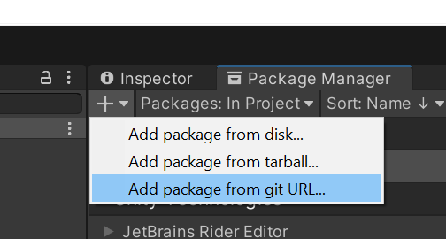

# Unity Runtime Import/Export
Allows for the runtime import and export of the following file formats in unity:

- OBJ

## TODO:

- FBX
- GLTF / GLB
- Collada
- DXF

## Importing into Project

Go to the Package Manager window, press the add button, and select "Add package from Git URL..."

Paste in this link: `https://github.com/tlsharkey/Unity-Runtime-Import-Export.git`
You may get an error saying import failed. **Paste in the link a second time.**
Unity will then import the package and display a series of errors in the Console. Unity will automatically fix all of these, you can safely clear them.
